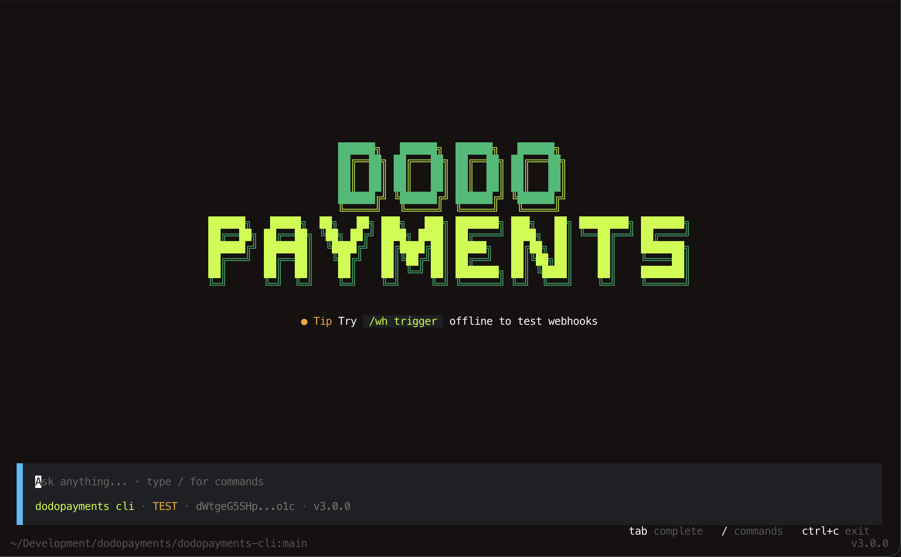

# Dodo Payments CLI

<p align="center">
  <strong>A powerful Command Line Interface for Dodo Payments</strong>
</p>

<p align="center">
  <a href="https://www.npmjs.com/package/dodopayments-cli">
    
  </a>
  <a href="https://discord.gg/bYqAp4ayYh">
    
  </a>
  <a href="LICENSE">
    
  </a>
</p>

<p align="center">
  <a href="#installation">Installation</a> •
  <a href="#authentication">Authentication</a> •
  <a href="#usage">Usage</a> •
  <a href="#ai-assistant">AI</a> •
  <a href="#webhooks">Webhooks</a> •
  <a href="#contributing">Contributing</a>
</p>

---

Manage your [Dodo Payments](https://dodopayments.com/) resources, test webhooks, and run AI-powered queries against your account — all from the terminal.

<p align="center">
  
</p>

## Features

- **Interactive TUI** — launch `dodo` with no arguments to open the full interactive interface with command palette, history, and live notifications.
- **AI assistant built in** — ask questions or take actions in plain English with `/ai`. No extra setup, runs `dodopayments-mcp` locally.
- **Secure by default** — API keys are stored in your OS secret store (macOS Keychain, Windows Credential Vault, Linux libsecret). No plaintext config on disk.
- **Auto update** — the CLI checks for new versions and notifies you in-app. Run `/update` to upgrade in place.
- **Webhook tooling** — listen for live webhooks or trigger payloads offline for local development.

## Installation

We provide multiple ways to install the CLI.

> **Note:** If you already have Node or Bun installed, the package-manager installs are the simplest path and always pull the latest version.

### Using npm

```bash
npm install -g dodopayments-cli
```

### Using Bun

```bash
bun install -g dodopayments-cli
```

### Manual installation (no Node / Bun required)

1. Download the binary for your platform from the latest [GitHub Release](https://github.com/dodopayments/dodopayments-cli/releases).

   | Platform | Binary |
   | --- | --- |
   | macOS (Apple Silicon) | `dodo-cli-darwin-arm64` |
   | macOS (Intel) | `dodo-cli-darwin-x64` |
   | Linux (x86_64) | `dodo-cli-linux-x64` |
   | Linux (arm64) | `dodo-cli-linux-arm64` |
   | Windows (x86_64) | `dodo-cli-windows-x64.exe` |

2. Rename the binary to `dodo`:
   - **Linux / macOS:** `mv ./dodo-cli-* ./dodo && chmod +x ./dodo`
   - **Windows:** `ren .\dodo-cli-windows-x64.exe .\dodo.exe`

3. Move it to a directory on your `PATH`:
   - **Linux / macOS:** `sudo mv ./dodo /usr/local/bin/`
   - **Windows:** `move .\dodo.exe C:\Windows\System32\dodo.exe` (requires admin)

4. (Optional) Verify the download against `SHA256SUMS.txt` published with each release:
   ```bash
   shasum -a 256 -c SHA256SUMS.txt
   ```

## Authentication

Before using authenticated commands you need to log in:

```bash
dodo login
```

…or, from inside the interactive TUI:

```
/login
```

The login flow will:

1. Open your browser to the Dodo Payments API Keys page.
2. Prompt you to paste your API Key.
3. Ask you to select an environment — **Test Mode** or **Live Mode**.
4. Store the credentials in your OS secret store (Keychain on macOS, Credential Vault on Windows, libsecret on Linux).

> **Heads up:** Because we use the OS secret store, you may be prompted for your **device password** the first time the CLI reads or writes credentials. If you're upgrading from an older version, any existing plaintext API key will be **migrated to the secret store and the legacy file deleted** automatically.

### Switching modes / logging out

You can keep one **Test Mode** and one **Live Mode** key authenticated at the same time. To clear credentials, use:

```bash
dodo logout
# or, in the TUI
/logout
```

The logout flow lets you choose between **All accounts**, **Test Mode**, or **Live Mode** independently.

## Usage

You can use the CLI in two modes:

### 1. Interactive TUI (recommended)

Just run:

```bash
dodo
```

This launches the full interactive interface. Type `/` to open the command palette, or just start typing — anything that isn't a slash command is sent to the AI assistant.

Use:
- `/help` to see all commands.
- `/exit` (or press `Esc` twice) to quit.
- `/clear` to clear the screen.
- `/update` to upgrade to the latest version when one is available.

### 2. Direct subcommands

You can also run commands directly without entering the TUI:

```bash
dodo <category> <sub-command> [args...]
```

For example:

```bash
dodo payments list 1
dodo customers create
dodo wh trigger
```

The reference tables below show every command. In the TUI, prefix them with `/`; in direct mode, drop the `/`.

---

### AI Assistant

Ask questions or take actions in natural language. The assistant uses `dodopayments-mcp` running locally — no additional setup or OAuth flow required, and your AI traffic doesn't leave your machine except to talk to the model provider.

| Command | Description |
| --- | --- |
| `/ai <query>` | Ask the AI assistant a question or give it an instruction |
| _(any non-slash text)_ | Sent to the AI assistant by default while in the TUI |

Examples:

```
how much revenue did I make this week?
/ai create a new customer named Acme Inc.
/ai find my last failed payment
```

The assistant respects your active environment (Test / Live).

### Products

| Command | Description |
| --- | --- |
| `/products list <page>` | List products |
| `/products create` | Open the dashboard to create a product |
| `/products info <id>` | View details for a specific product |

### Payments

| Command | Description |
| --- | --- |
| `/payments list <page>` | List payments |
| `/payments info <id>` | Get information about a specific payment |

### Customers

| Command | Description |
| --- | --- |
| `/customers list <page>` | List customers |
| `/customers create` | Create a new customer |
| `/customers update <id>` | Update an existing customer |

### Discounts

| Command | Description |
| --- | --- |
| `/discounts list <page>` | List discounts |
| `/discounts create` | Create a new percentage-based discount |
| `/discounts delete <id>` | Remove a discount by ID |

### Licenses

| Command | Description |
| --- | --- |
| `/licences list <page>` | List licenses |

### Addons

| Command | Description |
| --- | --- |
| `/addons list <page>` | List addons |
| `/addons create` | Open the dashboard to create an addon |
| `/addons info <id>` | View details for a specific addon |

### Refunds

| Command | Description |
| --- | --- |
| `/refunds list <page>` | List refunds |
| `/refunds info <id>` | View details for a specific refund |

### Checkout

| Command | Description |
| --- | --- |
| `/checkout new` | Interactively create a hosted checkout session and get a payment link |

### Webhooks

Manage and test webhooks directly from the CLI.

| Command | Description |
| --- | --- |
| `/wh listen` | Listen for webhooks in real time and forward them to your local dev server |
| `/wh trigger` | Trigger a test webhook event interactively — even while logged out |

The `/wh trigger` flow guides you through:

1. Setting a destination **endpoint URL**
2. Selecting a specific **event** to trigger

> **Note:** `/wh trigger` does **not** require login. It works as a local/offline webhook payload generator.

> **Note:** Triggered events are **not signed** yet. While testing, disable webhook signature verification on your endpoint — for example, use `unsafe_unwrap()` instead of `unwrap()` in your webhook handler **during testing only**.

> **Note:** `/wh listen` requires a **Test Mode** API key. Live Mode keys are not supported by the listen flow.

### Supported Webhook Events

| Category | Events |
| --- | --- |
| **Subscription** | `active`, `updated`, `on_hold`, `renewed`, `plan_changed`, `cancelled`, `failed`, `expired` |
| **Payment** | `success`, `failed`, `processing`, `cancelled` |
| **Refund** | `success`, `failed` |
| **Dispute** | `opened`, `expired`, `accepted`, `cancelled`, `challenged`, `won`, `lost` |
| **License** | `created` |

### Session commands

| Command | Description |
| --- | --- |
| `/help` | Show the command reference |
| `/update` | Check for and install a CLI update |
| `/login` | Authenticate with an API key |
| `/logout` | Sign out of one or all environments |
| `/clear` | Clear the TUI screen |
| `/exit` | Exit the TUI (also: type `exit`, or press `Esc` twice) |

## Updates

The CLI checks for a newer version on startup and surfaces a notification in the status bar when one is available. To upgrade:

```
/update
```

Or, if you installed via a package manager, the usual `npm i -g dodopayments-cli` / `bun i -g dodopayments-cli` will also work.

## Contributing

We welcome contributions from the community — whether you're fixing bugs, adding new features, or improving docs.

Please read our [Contributing Guide](./CONTRIBUTING.md) to get started. We also have a [Code of Conduct](./CODE_OF_CONDUCT.md) that we expect all contributors to follow.

### Ways to contribute

- Report bugs and suggest features
- Improve documentation
- Add new CLI commands
- Write tests
- Review pull requests

## Support

- [Discord Community](https://discord.gg/bYqAp4ayYh) — chat with the team and other users
- [GitHub Issues](https://github.com/dodopayments/dodopayments-cli/issues) — report bugs or request features
- [Documentation](https://docs.dodopayments.com) — learn more about Dodo Payments

## License

This project is licensed under the **GNU General Public License v3.0 or later** — see the [LICENSE](./LICENSE) file for the full text.

```
Dodo Payments CLI — manage Dodo Payments resources from the terminal.
Copyright (C) 2025  Dodo Payments

This program is free software: you can redistribute it and/or modify it
under the terms of the GNU General Public License as published by the
Free Software Foundation, either version 3 of the License, or (at your
option) any later version.

This program is distributed in the hope that it will be useful, but
WITHOUT ANY WARRANTY; without even the implied warranty of MERCHANTABILITY
or FITNESS FOR A PARTICULAR PURPOSE.  See the GNU General Public License
for more details.
```

---

<p align="center">
  Made with ❤️ by <a href="https://dodopayments.com">Dodo Payments</a>
</p>
